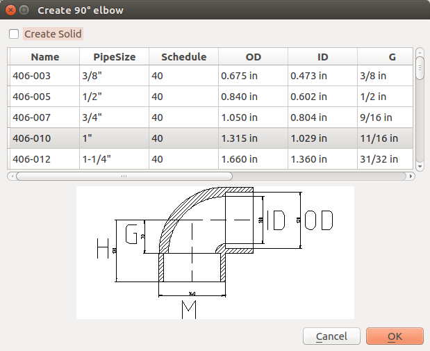
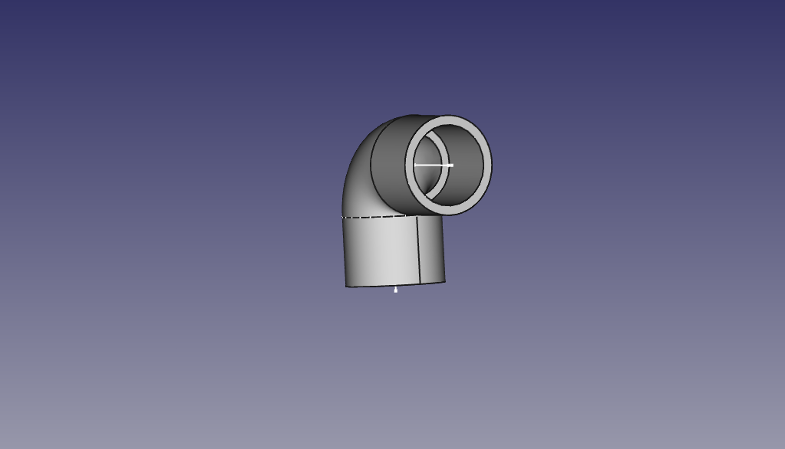

# OSE Piping library #
This project contains FreeCAD macros to create various pipe, tee, and elbow fittings.
It is made for [Open Source Ecology](http://opensourceecology.org). The project is a very early experemental state.

## Installation ##
Linux:

1. Copy the all files from **macro**  directory to **./FreeCAD** in your home directory.
2. (Optional) Customize **90-deg-elbow.csv**.

## Usage ##

1. Open or create a FreeCAD document.
2. Select **Macro**->**Macros Menu**.
3. Select **create-pipe.FCMacro**, **create-elbow-90.FCMacro** or **create-tee.FCMacro** and click **Execute**.
   
## Example ##

creates

