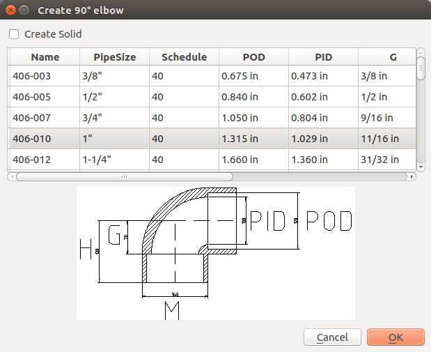
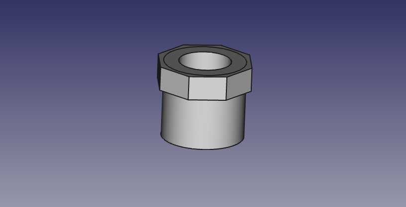
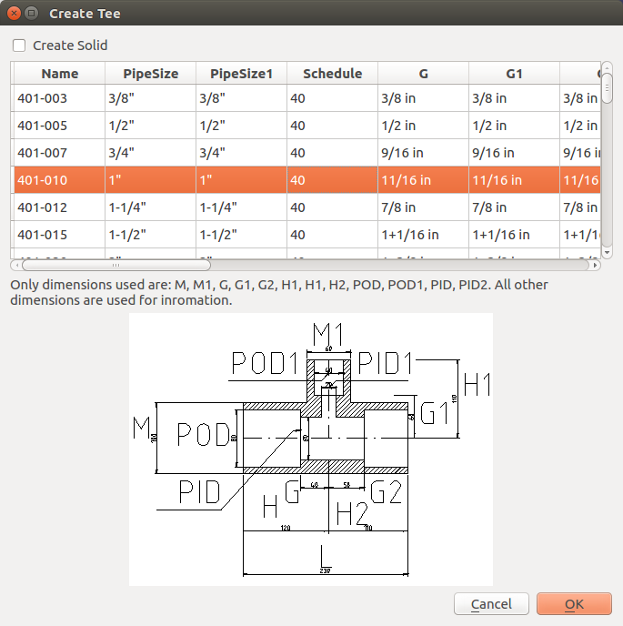

# OSE Piping library #
This project contains FreeCAD macros to create various pipe, tee, and elbow fittings.
It is made for [Open Source Ecology](http://opensourceecology.org). The project is a very early experemental state.
# Project is discontinued
This project is discontinued. The macros are moved to OSE-piping-workbench.

## Installation ##
Linux:

1. Copy the all files from **macro**  directory to **./FreeCAD** in your home directory.
2. (Optional) Customize **90-deg-elbow.csv**.

## Usage ##

1. Open or create a FreeCAD document.
2. Select **Macro**->**Macros Menu**.
3. Select **create-pipe.FCMacro**, **create-elbow-90.FCMacro** or **create-tee.FCMacro** and click **Execute**.

## Example ##
### 90°-elbow ###

creates

### alpha°-Elbow ###
Create an arbitrary elbow with the angle alpha within the range of 0°-180°.

creates

### Coupling ###
Create a centric coupling between two equal or different pipe sizes.

creates

### Bushing ###
Create a bushing between two different pipe sizes. Not copling and bushings are different.

creates

.

### Tee ###
Create an arbitrary elbow with the angle alpha within the range of 0°-180°.

creates

### Cross ###
Create a cross between equal or different pipes.

creates

